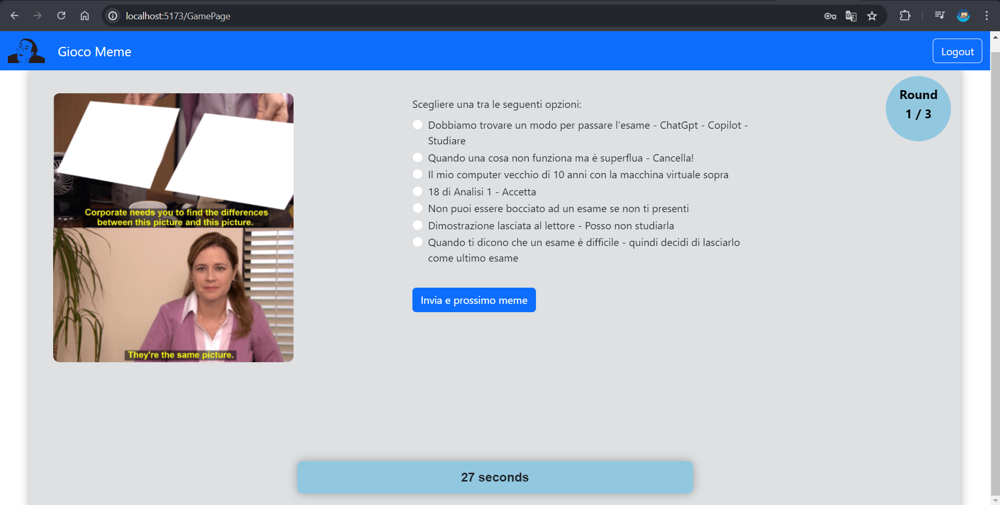
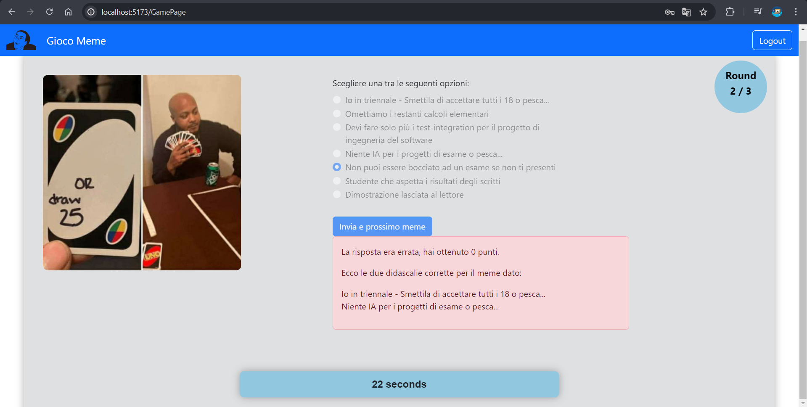

# Gioco dei meme

## Indice 
0. [Descrizione](#descrizione)
1. [Server-side](#server-side)
   - [API HTTP Offerte dal server](#1---api-http-offerte-dal-server)
   - [Tabelle del Database](#2---tabelle-del-database)
2. [Client-side](#client---side)
   - [Route dell'Applicazione React](#route-dellapplicazione-react)
   - [Principali Componenti React](#principali-componenti-react)
3. [Informazioni Generali](#informazioni-generali)
   - [Screenshot dell'Applicazione](#screenshot-dellapplicazione)
   - [Credenziali Utenti Registrati](#credenziali-utenti-registrati)

## Descrizione

Nel gioco, ogni giocatore riceve un’immagine di un meme casuale e sette possibili didascalie per quel meme: il giocatore deve indovinare la didascalia “giusta” per il meme.
Il gioco si basa su un archivio di diverse immagini di meme. Ogni immagine di meme è associata ad almeno due didascalie che meglio si adattano all'immagine. È possibile che una didascalia sia associata a più di un meme. Gli studenti sono liberi di utilizzare i meme e le didascalie che preferiscono.

## Server - side
### 1 - API HTTP Offerte dal server

1. **GET /api/memes/:excludeIds?**
   - Descrizione: Restituisce una lista di meme, escludendo quelli con specifici ID forniti.
   - Parametri: `excludeIds` (opzionale) - Una lista di ID separati da virgola.
   - Risposta: `{ memes }`

2. **GET /api/memes/correct/:id**
   - Descrizione: Restituisce un meme specifico con l'ID corretto.
   - Parametri: `id` - L'ID del meme.
   - Risposta: `{ meme }`

3. **GET /api/memes/:id/captions**
   - Descrizione: Restituisce gli (2) id_didascalie corretti per un meme specifico.
   - Parametri: `id` - L'ID del meme.
   - Risposta: `{ captions }`

4. **GET /api/memes/:id/captions/random**
   - Descrizione: Restituisce cinque id_didascalie casuali per un meme specifico (escludendo quelle corrette).
   - Parametri: `id` - L'ID del meme.
   - Risposta: `{ captions }`

5. **GET /api/captions/:ids**
   - Descrizione: Restituisce le didascalie in testo per specifici ID.
   - Parametri: `ids` - Una lista di ID separati da virgola.
   - Risposta: `{ captions }`

6. **GET /api/users/:id/games**
   - Descrizione: Restituisce le partite associati a un utente specifico.
   - Parametri: `id` - L'ID dell'utente.
   - Risposta: `{ games }`

7. **GET /api/games/:id/rounds**
   - Descrizione: Restituisce i round di una partita specifica.
   - Parametri: `id` - L'ID del gioco.
   - Risposta: `{ rounds }`

8. **POST /api/games**
   - Descrizione: Inserisce una nuova partita.
   - Parametri: `user_id` - L'ID dell'utente, `score` - Il punteggio del gioco.
   - Risposta: `{ game }`

9. **POST /api/rounds**
   - Descrizione: Inserisce un nuovo round.
   - Parametri: `meme_id` - L'ID del meme, `caption_id` - L'ID della didascalia, `score` - Il punteggio del round.
   - Risposta: `{ round }`

10. **POST /api/sessions**
   - Descrizione: Autentica un utente con `username` e `password`.
   - Parametri: `{ username, password }`
   - Risposta: `{ user }`

11. **GET /api/sessions/current**
   - Descrizione: Restituisce le informazioni dell'utente attualmente autenticato.
   - Parametri: nessuno
   - Risposta: `{ user }`

12. **DELETE /api/sessions/current**
   - Descrizione: Disconnette l'utente attualmente autenticato.
   - Parametri: nessuno
   - Risposta: nessuna

### 2 - Tabelle del Database
1. **Users**: Contiene le informazioni degli utenti registrati.
   - `id`: INTEGER PRIMARY KEY AUTOINCREMENT
   - `username`: TEXT UNIQUE NOT NULL
   - `hash`: TEXT NOT NULL
   - `salt`: TEXT NOT NULL

2. **Games**: Contiene le informazioni delle partite di gioco.
   - `id`: INTEGER PRIMARY KEY AUTOINCREMENT
   - `user_id`: INTEGER
   - `total_score`: INTEGER
   - FOREIGN KEY (`user_id`) REFERENCES `users`(`id`)

3. **Rounds**: Contiene i round effettuati durante le partite.
   - `id`: INTEGER PRIMARY KEY AUTOINCREMENT
   - `meme_id`: INTEGER
   - `caption_id`: INTEGER
   - `score`: INTEGER NOT NULL
   - `game_id`: INTEGER NOT NULL
   - FOREIGN KEY (`meme_id`) REFERENCES `memes`(`id`)
   - FOREIGN KEY (`caption_id`) REFERENCES `captions`(`id`)
   - FOREIGN KEY (`game_id`) REFERENCES `games`(`id`)

4. **Memes**: Contiene le informazioni sui meme.
   - `id`: INTEGER PRIMARY KEY AUTOINCREMENT
   - `name`: TEXT UNIQUE NOT NULL

5. **Captions**: Contiene le didascalie.
   - `id`: INTEGER PRIMARY KEY AUTOINCREMENT
   - `didascalia`: TEXT NOT NULL

6. **Memes_Captions**: Contiene le associazioni corrette tra meme e didascalie.
   - `meme_id`: INTEGER
   - `caption_id`: INTEGER
   - PRIMARY KEY (`meme_id`, `caption_id`)
   - FOREIGN KEY (`meme_id`) REFERENCES `memes`(`id`)
   - FOREIGN KEY (`caption_id`) REFERENCES `captions`(`id`)
## Client - Side

### Route dell'Applicazione React

1. **/**: Pagina principale, visualizza il menu di benvenuto.
2. **/login**: Pagina di login per l'autenticazione degli utenti.
3. **/GamePage**: Pagina di gioco, mostra lo stato corrente della partita e permette di fare mosse.
4. **/UserProfile**: Pagina del profilo utente, visualizza le informazioni dell'utente e i giochi (cronologia delle partite).
5. **/SummaryPage**: Pagina di riepilogo, mostra i dettagli dei round e dei punteggi della partita appena giocata.

### Principali Componenti React

1. **App**: Componente principale dell'applicazione.
2. **NavHeader**: Barra di navigazione dell'applicazione.
3. **AuthComponents**: Form di autenticazione per gli utenti.
4. **GamePage**: Componente per gestire la logica e l'interfaccia del gioco.
5. **UserProfile**: Visualizza le informazioni dell'utente autenticato e tutte le informazioni sulle sue partite.
6. **SummaryPage**: Visualizza il riepilogo dei round e dei punteggi della partita appena giocata.

## Informazioni Generali

### Screenshot dell'Applicazione

### Credenziali Utenti Registrati

- **Username**: fabi, **Password**: fabiano
- **Username**: marco, **Password**: marco